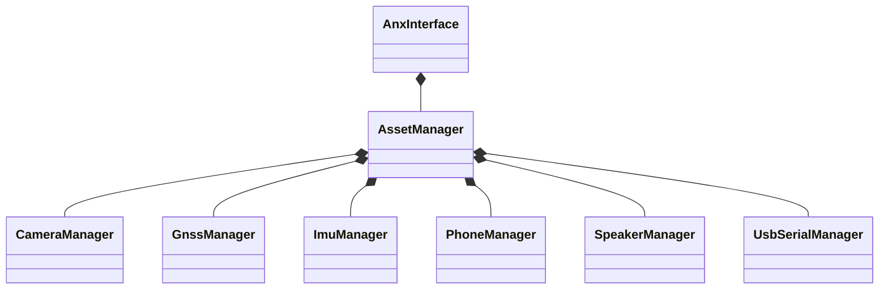

# anx_interface 
> Implements [anx_api](https://github.com/flomobility/api_docs/tree/v0.1.1)

## Class Diagram

## Style Guide
* For CPP:
  + [Google CPP Style Guide](https://google.github.io/styleguide/cppguide.html)
* For Python:
  + [Google Python Style Guide](https://google.github.io/styleguide/pyguide.html) 
